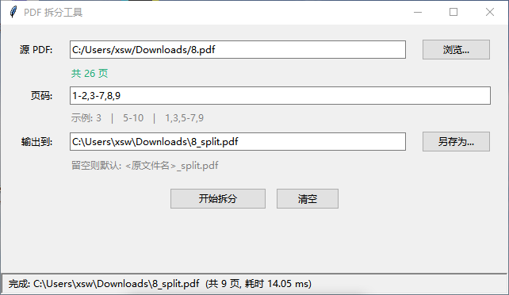
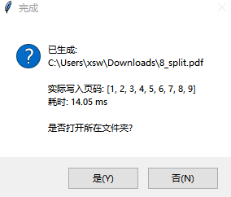

# PDF 拆分工具

按指定页码从 PDF 中提取一页或多页,生成新的 PDF。提供命令行和图形界面两种用法。

## 界面预览

**主界面** — 选中 PDF 后自动显示总页数,支持三种页码语法,状态栏显示毫秒级耗时:



**完成弹窗** — 显示实际写入页码列表和精确耗时,一键打开输出文件夹:



## 功能

- 支持三种页码语法:
  - 单页: `3`
  - 范围: `5-10`
  - 组合: `1,3,5-7,9`
- 页码按用户给的顺序写入新 PDF,自动去重,越界会报错
- CLI 版适合脚本化调用;GUI 版零 Python 经验也能用

## 依赖

```bash
pip install pypdf
```

脚本会自动回退到 `PyPDF2`(若已安装)。

## 命令行版 (`pdf_split.py`)

```bash
python pdf_split.py <input.pdf> <pages> [output.pdf]
```

示例:

```bash
# 提取第 1、3、5-7 页
python pdf_split.py book.pdf 1,3,5-7 out.pdf

# 省略输出路径,默认生成 book_split.pdf
python pdf_split.py book.pdf 5-10

# 单页
python pdf_split.py book.pdf 3
```

## 图形界面版 (`pdf_split_gui.py`)

```bash
python pdf_split_gui.py
```

- 选中源 PDF 后自动显示总页数并预填输出路径
- 后台线程执行,拆分大 PDF 时窗口不会卡死
- 完成后可一键打开所在文件夹

## 打包成 exe (可选)

```bash
pip install pyinstaller
pyinstaller -F -w --name "PDF拆分工具" pdf_split_gui.py
```

产物在 `dist/PDF拆分工具.exe`,单文件、无需 Python 环境即可运行。

## Windows 中文路径提示

Windows cmd 默认 GBK 编码,`print` 中文文件名可能显示乱码,**但生成的 PDF 文件本身完全正确**。想让终端也正常显示中文:

```bash
chcp 65001
```
